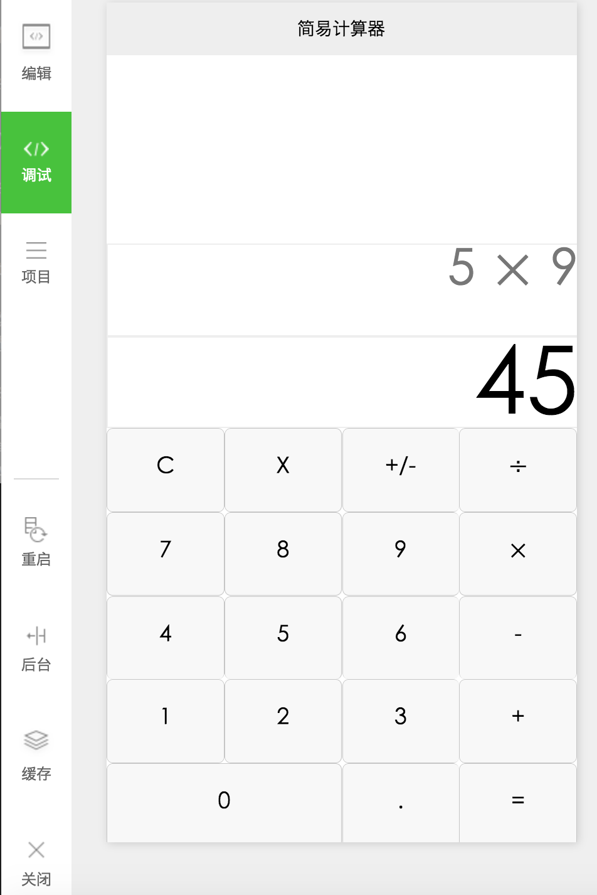

### 微信小程序-简易计算器

微信小程序已经出来一段时间了，网上关于小程序的demo也有一些。在看了官方文档后，自己动手实现了一个简易的计算器。

### 效果图

### 使用方法
- clone项目 

 git clone https://github.com/zhouxiongking/wechat-calculator.git
 
- 微信开发者工具中添加项目
- 选择项目目录

### 文档
- [简易教程](https://mp.weixin.qq.com/debug/wxadoc/dev/?t=1475052052547)
- [常用组件](https://mp.weixin.qq.com/debug/wxadoc/dev/component/?t=1475052047016)
- [API文档](https://mp.weixin.qq.com/debug/wxadoc/dev/api/?t=1475052046827)